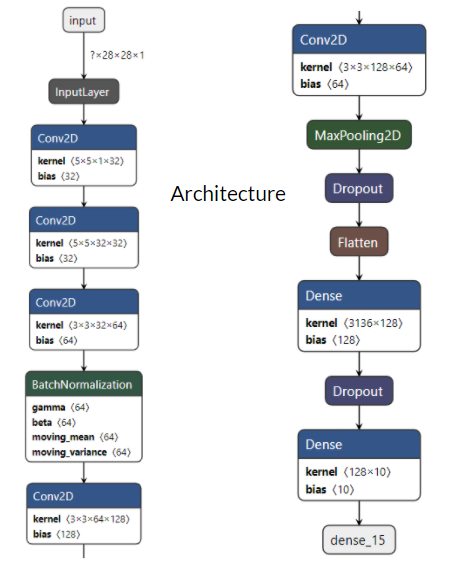
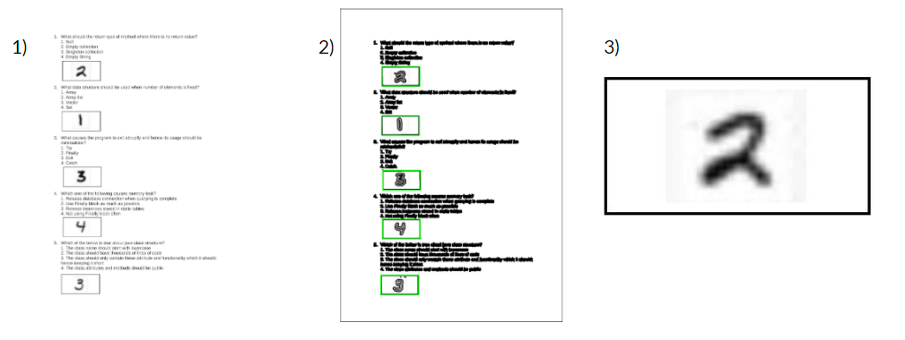

# Auto-Grade

Converting handwritten answers to text using Handwriting recognition technique and grading them accordingly.

# Model
Dataset: MNIST dataset was used.

Architecture:

**Training accuracy : 98%**

**Test accuracy :  99.01%**

# Answer Detection

- First we convert the pdf to image
- Then using opencv we detect the rectangles in which the answers should be given.
- Cropping out the answers and processing it before passing it to the model for prediction.
- Prediction
 

# To run files on the website check out the format or use :
Data/answers-multipage.csv
Data/answers-multipage.pdf
